# terraform-example-ecs-fargate
Minimal Example of Terraform - ECS on Fargate

## Architecture


You can access the `app ECS tasks` through the `web ECS tasks` and an `ALB`.

In this example, network communication to each ECS tasks is provided by

- app ECS task: Application Load Balancer
- web ECS task: ECS Service Connect

Traffic Route Details:

```
client
 |
 | ALB
 |
web ECS tasks
 |
 | ECS Service Connect
 |
app ECS tasks
```

## ECS detail


### IAM Roles
ECS uses three important roles.

#### 1️⃣ Service-linked role
Allow ECS service to call AWS APIs on your behalf.
This role is provided as managed role named `AWSServiceRoleForECS`.

- Allow creating ENIs for each task.
- Allow registering tasks to load balancer.
- Allow registering DNS and service discovery.

#### 2️⃣ Task execution role
Allow ECS container and Fargate agents to call AWS APIs on your behalf.

- Allow pulling image from ECR repository.
- Allow writing logs to CloudWatch Logs.
- Allow referencing Secrets manager or SSM Parameter store.

#### 3️⃣ Task role
Allow ECS tasks to access to other AWS resources which are necessary to run application.

Permissions for using ECS Exec also need to be attached to this role.

### ECS Service Connect
ECS's service-to-service communication can be provided some ways.

1. ALB
2. Cloud Map Service Discovery
3. App Mesh
4. ECS Service Connect

ECS Service Connect provides both service discovery and a service mesh.
When using ECS Service Connect, there are two type of options.

1. Clinet
2. Client-server

Required configuration for each type is mentioned in below link.

https://docs.aws.amazon.com/AmazonECS/latest/developerguide/service-connect.html#service-connect-parameters

A container for ECS Service Connect is deployed automatically to each task.
You don't need to write the code yourself explicitly in the task definition for that.

### ECS Exec
To use ECS Exec for the container in private subnets, you need to configure follow resources.

1. VPC Endpoint: ssmmessages
2. VPC Endpoint: kms (When using additional command encryption)
3. Task role: [Allow access to ssmmessages](https://docs.aws.amazon.com/AmazonECS/latest/developerguide/task-iam-roles.html#ecs-exec-required-iam-permissions)
4. Task role: [Allow access to kms](https://docs.aws.amazon.com/AmazonECS/latest/developerguide/ecs-exec.html#ecs-exec-logging) (When using additional command encryption)

### Pull container image from ECS Public Resistory
As of March 2024, VPC Endpoints for ECR don't support Amazon ECR Public repositories.

https://docs.aws.amazon.com/AmazonECR/latest/userguide/vpc-endpoints.html#ecr-vpc-endpoint-considerations

You can access Amazon ECR Public repositories by using pull through cache instead.

## Code structure
```
terraform
.
├── envs
│   └── example
│       ├── main.tf
│       ├── providers.tf
│       ├── terraform.tfstate
│       └── terraform.tfstate.backup
└── modules
    ├── container
    │   ├── cloudmap.tf
    │   ├── cloudwatch_logs_ecs_task_app.tf
    │   ├── cloudwatch_logs_ecs_task_web.tf
    │   ├── data.tf
    │   ├── ecs_cluster.tf
    │   ├── ecs_service_app.tf
    │   ├── ecs_service_web.tf
    │   ├── ecs_task_definition_app.tf
    │   ├── ecs_task_definition_web.tf
    │   ├── iam_ecs_service_linked_role.tf
    │   ├── iam_ecs_task_execution_role_app.tf
    │   ├── iam_ecs_task_execution_role_web.tf
    │   ├── iam_ecs_task_role_app.tf
    │   ├── iam_ecs_task_role_web.tf
    │   ├── kms_ecs_exec.tf
    │   ├── security_group_app.tf
    │   ├── security_group_web.tf
    │   └── variables.tf
    ├── ecr_pull_through_cache
    │   └── ecr_pull_through_cache.tf
    ├── loadbalancer
    │   ├── alb.tf
    │   ├── outputs.tf
    │   ├── security_group.tf
    │   └── variables.tf
    └── network
        ├── data.tf
        ├── internet_gateway.tf
        ├── outputs.tf
        ├── route_table_private.tf
        ├── route_table_public.tf
        ├── security_group_vpc_endpoint.tf
        ├── subnet_private.tf
        ├── subnet_public.tf
        ├── variables.tf
        ├── vpc.tf
        └── vpc_endpoint.tf
```
