# terraform-example-ecs-fargate
Minimum example of terrarraform - ECS on Fargate

## Architecture


### ECS detail
ECS has three important IAM Roles.



## Code structure
```
terraform
├── env
│   └── example
│       ├── aws.tf
│       └── main.tf
└── module
    ├── container
    │   ├── ecs_cluster.tf
    │   ├── ecs_service.tf
    │   ├── ecs_task.tf
    │   └── variables.tf
    ├── loadbalancer
    │   ├── alb.tf
    │   ├── output.tf
    │   └── variables.tf
    └── network
        ├── output.tf
        └── vpc.tf
```
